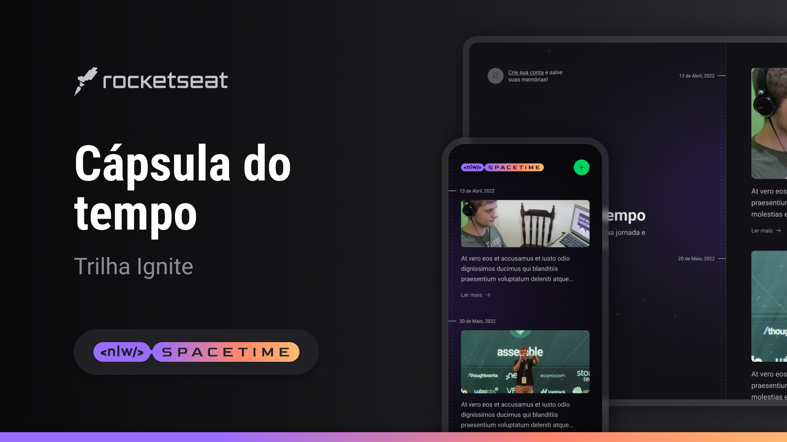

<h1 align="center"> NLW Spacetime - Cápsula do Tempo </h1>

Projeto desenvolvido ao longo do evento Next Level Week da Rocketseat, edição NLW Spacetime.

  <a href="#-projeto">Projeto</a>&nbsp;&nbsp;&nbsp;|&nbsp;&nbsp;&nbsp;
  <a href="#-tecnologias">Tecnologias</a>&nbsp;&nbsp;&nbsp;|&nbsp;&nbsp;&nbsp;
  <a href="#-como-executar">Como executar</a>&nbsp;&nbsp;&nbsp;|&nbsp;&nbsp;&nbsp;
  <a href="#-layout">Layout</a>

 

  

## 💻 Projeto

A cápsula do tempo é uma aplicação *full-stack*, do back-end ao mobile, que serve para guardar memórias numa timeline.

## ✨ Tecnologias

Esse projeto foi desenvolvido com as seguintes tecnologias:

- ReactJS
- Next.js
- Node.js
- Fastify
- ReactNative
- Expo
- TailwindCSS
- NativeWind

## 🚀 Como executar

Para executar a aplicação é necessário usar os seguintes comandos no terminal:

As instruções de como instalar e inicializar cada parte do projeto estarão dentro de suas respectivas pastas, contudo, certifique-se de inicializar o back-end antes do front-end ou do mobile.

## 🔖 Layout

Você pode visualizar o layout do projeto através [DESSE LINK](https://www.figma.com/file/RGKzj1BrIBLCSOWnfQnSud/C%C3%A1psula-do-tempo-%E2%80%A2-Trilha-Ignite?type=design&node-id=205%3A85&t=KrwMUIFCdygfKnav-1).
